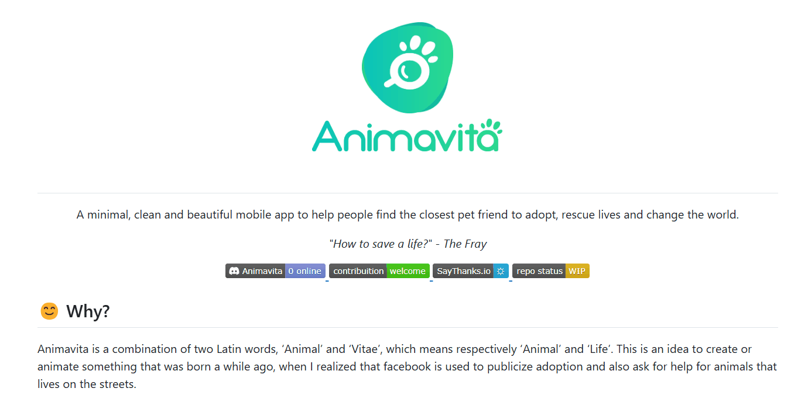

# Projeto com README

Um projeto de teste com um arquivo README 🚀

## Tecnologias utilizadas
- HTML
- CSS
- JavaScript

## Como utilizar

1 - Faça o clone do repositório remoto

git clone < url do repositório >

2 - Acesse a pasta do projeto

cd repositorio-com-readme